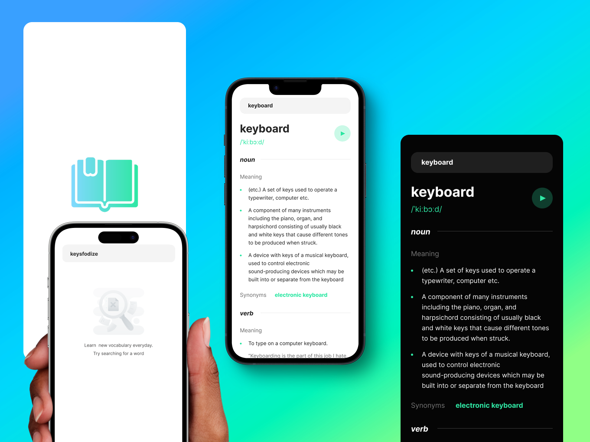

# open-dictionary
An Open source dictionary mobile app created with expo and using the Free Dictionary API.    


## Features    
- Search for a word    
- Click on any word to search    
- Get definition of the word    
- Get synonyms of the word    
- Get antonyms of the word    
- Get examples of the word    
- Get type of the word    
- Get pronunciation of the word    
- Adapts to dark and light mode based on user device settings    

## Screenshots
    

## Installation
1. Clone the repository    
```bash
git clone https://github.com/KBismark/open-dictionary.git
```    

2. Change directory    
```bash
cd open-dictionary
```    

3. Install dependencies    
```bash
npm install
```    

4. Start the app    
```bash
npx expo start
```    


## License
[MIT](https://choosealicense.com/licenses/mit/)     
You are free to use this project for personal and commercial purposes.    


## Contributing
Pull requests are welcomed. For major changes, please open an issue first to discuss what you would like to change.    


## Acknowledgements
- [Free Dictionary API](https://dictionaryapi.dev/)    


